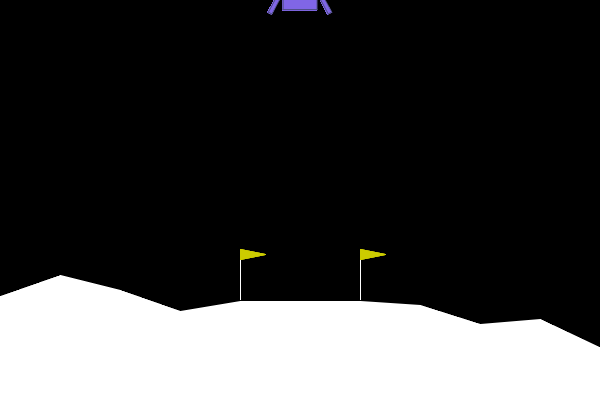
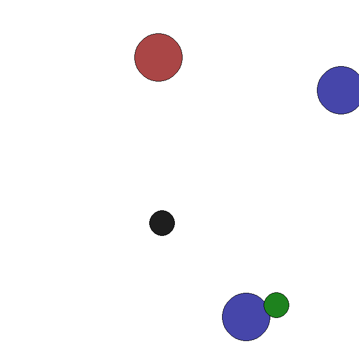
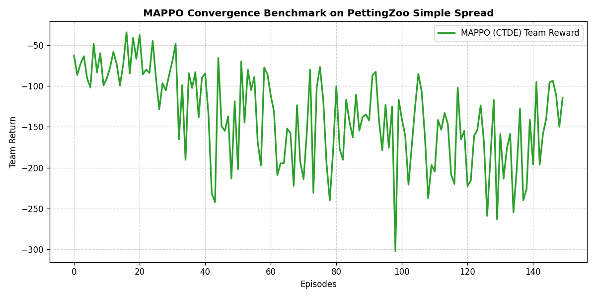

# Deep Reinforcement Learning & Multi-Agent RL Implementations

A collection of notebook-driven and modular implementations of reinforcement learning algorithms, with training experiments, benchmark plots, saved models, and agent rollouts. The repository covers both single-agent continuous-control methods and multi-agent policy-learning approaches.

> **Research and reproduction note:** The folder names and notebook descriptions do not always match the algorithm implemented by the accompanying source code. The distinctions are documented below so that the repository is not mistaken for a strict reproduction of every paper.

## Contents

- [Algorithms at a glance](#algorithms-at-a-glance)
- [Results and rollouts](#results-and-rollouts)
- [Research papers and implementation notes](#research-papers-and-implementation-notes)
- [Repository structure](#repository-structure)
- [Setup](#setup)
- [Running the notebooks and scripts](#running-the-notebooks-and-scripts)
- [Reproducibility notes](#reproducibility-notes)
- [Citation and attribution](#citation-and-attribution)

## Algorithms at a glance

| Folder | Algorithm stated in notebook | What the source code indicates | Main environment / experiment |
| --- | --- | --- | --- |
| `DDPG/` | DDPG | The modular benchmark code implements **TD3**, not vanilla DDPG | Gymnasium `LunarLanderContinuous-v3` |
| `MADDPG/` | MADDPG | The modular agent is named **MATD3** and uses twin critics / delayed actor updates | PettingZoo / MPE `simple_adversary_v3` |
| `MAPPO/` | MAPPO | MAPPO with centralized critic and decentralized actors (CTDE) | PettingZoo / MPE `simple_spread_v3` |
| `PPO/` | PPO | An enhanced PPO agent with GAE and optional KL-related controls | Gymnasium `BipedalWalker-v3` |

This is an educational/research code collection, not a claim that every experiment is a paper-exact reproduction. See each entry below for the important differences between notebook labels and source implementation.

## Results and rollouts

### DDPG folder — TD3 LunarLander rollout



The animation is stored at `DDPG/results/lunarlander_agent.gif`. The accompanying benchmark configuration specifies `LunarLanderContinuous-v3`.

### MADDPG folder — MATD3 multi-agent rollout



The notebook identifies the experiment as MADDPG, but the source imports and trains `MATD3` (`maddpg_project/src/agents/matd3.py`). Treat this animation as the result of the code in the folder, rather than as verified evidence of a vanilla MADDPG implementation.

### MAPPO — Simple Spread benchmark



A benchmark plot is included in the archive. **No MAPPO GIF was present in the uploaded archive**, so the existing training plot is shown instead. If you add an evaluation rollout later, place it under `MAPPO/MAPPO-Engine-Benchmark/videos/` and update this section to point to it.

### PPO — trained-agent rollout


The PPO notebook benchmarks `BipedalWalker-v3` across multiple random seeds. The GIF is included at `PPO/PPO-Engine-Benchmark/videos/trained_agent.gif`.

> GitHub renders these assets when the repository is uploaded with the same relative paths. Keep the folder names and capitalization unchanged, or update the image paths above.

## Research papers and implementation notes

### 1. DDPG folder — DDPG paper reference, TD3 code

**Paper referenced in the notebook**

- **Title:** *Continuous Control with Deep Reinforcement Learning*
- **Authors:** Timothy P. Lillicrap, Jonathan J. Hunt, Alexander Pritzel, Nicolas Heess, Tom Erez, Yuval Tassa, David Silver, and Daan Wierstra
- **Year:** 2015 (arXiv preprint)
- **Research area:** Deep reinforcement learning; deterministic policy gradients for continuous control
- **Links:** [arXiv abstract](https://arxiv.org/abs/1509.02971) · [PDF](https://arxiv.org/pdf/1509.02971)

**What the paper contributes:** DDPG combines an actor–critic architecture with deterministic policy gradients, target networks, and replay-buffer learning to handle continuous action spaces.

**Important implementation distinction:** `DDPG/DDPG.ipynb` cites the DDPG paper, but the modular project under `DDPG/td3_benchmark/` is explicitly configured with `algo: "td3"` and defines a `TD3Agent` with twin Q-value estimates, delayed actor updates, target-policy smoothing/noise, and replay-buffer sampling. These are TD3 features, so the code should not be described as a pure DDPG implementation.

**Paper that matches the modular code more closely**

- **Title:** *Addressing Function Approximation Error in Actor-Critic Methods*
- **Authors:** Scott Fujimoto, Herke van Hoof, and David Meger
- **Venue:** Proceedings of the 35th International Conference on Machine Learning (ICML), PMLR 80, 2018, pp. 1587–1596
- **Core idea:** Twin critics and the minimum target value reduce overestimation; delayed policy updates and target-policy smoothing improve stability.
- **Links:** [PMLR paper page](https://proceedings.mlr.press/v80/fujimoto18a.html) · [arXiv](https://arxiv.org/abs/1802.09477) · [PDF](https://proceedings.mlr.press/v80/fujimoto18a/fujimoto18a.pdf)

### 2. MADDPG folder — MADDPG reference, MATD3 code

**Paper referenced in the notebook**

- **Title:** *Multi-Agent Actor-Critic for Mixed Cooperative-Competitive Environments*
- **Authors:** Ryan Lowe, Yi Wu, Aviv Tamar, Jean Harb, Pieter Abbeel, and Igor Mordatch
- **Venue:** Advances in Neural Information Processing Systems 30 (NeurIPS 2017), pp. 6379–6390
- **Research area:** Multi-agent deep reinforcement learning in cooperative and competitive settings
- **Links:** [NeurIPS paper page](https://proceedings.neurips.cc/paper_files/paper/2017/hash/68a9750337a418a86fe06c1991a1d64c-Abstract.html) · [arXiv](https://arxiv.org/abs/1706.02275) · [PDF](https://arxiv.org/pdf/1706.02275)

**What the paper contributes:** MADDPG extends actor–critic learning to multi-agent environments by using centralized critics that can condition on information about all agents during training, while actors execute using their own local observations. This centralized-training/decentralized-execution approach helps address the non-stationarity caused by concurrently learning agents.

**Important implementation distinction:** The notebook heading cites MADDPG, but the source file is `MADDPG/maddpg_project/src/agents/matd3.py`, and the notebook imports `MATD3`. That implementation uses twin critics and delayed actor updates, which are TD3-style extensions. Therefore, the cited MADDPG paper is the conceptual multi-agent reference, but the code should be labelled **MATD3 / TD3-style multi-agent actor–critic** unless it is changed to implement the original MADDPG update rules.

The archive does not identify a separate paper specifically used to implement MATD3. The most direct additional reference for the TD3 components is Fujimoto et al. (2018), *Addressing Function Approximation Error in Actor-Critic Methods* (linked above). This is a methodological connection, not a claim that the cited paper itself introduced MATD3.

### 3. MAPPO

**Paper referenced in the notebook**

- **Title:** *The Surprising Effectiveness of PPO in Cooperative, Multi-Agent Games*
- **Authors:** Chao Yu, Akash Velu, Eugene Vinitsky, Jiaxuan Gao, Yu Wang, Alexandre Bayen, and Yi Wu
- **First posted:** 2021 on arXiv; subsequently published in the NeurIPS 2022 Datasets and Benchmarks Track
- **Research area:** On-policy multi-agent reinforcement learning for cooperative tasks
- **Links:** [arXiv abstract](https://arxiv.org/abs/2103.01955) · [PDF](https://arxiv.org/pdf/2103.01955) · [official MAPPO implementation](https://github.com/marlbenchmark/on-policy)

**What the paper contributes:** The paper demonstrates that PPO-based multi-agent methods can be strong, practical baselines across several cooperative benchmarks. MAPPO commonly uses centralized value estimation during training while each agent selects actions from local observations at execution time.

**Implementation notes:** `MAPPO/MAPPO-Engine-Benchmark/src/agents/mappo.py` explicitly describes centralized training and decentralized execution (CTDE), uses a centralized critic and decentralized actor, and supports parameter sharing. The notebook trains on PettingZoo MPE `simple_spread_v3`. This is a compact educational benchmark and should not be presented as a full reproduction of all environments and hyperparameter studies in the paper.

### 4. PPO

**Paper referenced in the notebook**

- **Title:** *Proximal Policy Optimization Algorithms*
- **Authors:** John Schulman, Filip Wolski, Prafulla Dhariwal, Alec Radford, and Oleg Klimov
- **Year:** 2017 (arXiv preprint)
- **Research area:** On-policy policy-gradient reinforcement learning
- **Links:** [arXiv abstract](https://arxiv.org/abs/1707.06347) · [PDF](https://arxiv.org/pdf/1707.06347)

**What the paper contributes:** PPO optimizes a clipped surrogate objective to limit overly large policy updates while retaining the practical simplicity of policy-gradient methods. It commonly reuses collected trajectories for multiple minibatch optimization epochs.

**Implementation notes:** The modular agent in `PPO/PPO-Engine-Benchmark/src/agents/ppo.py` is named `AdvancedPPOAgent` and includes generalized advantage estimation (GAE), gradient clipping, entropy/value-loss coefficients, and optional KL-related controls. The notebook uses `BipedalWalker-v3` and runs a multi-seed benchmark. These are implementation and experimental choices; the original PPO paper does not prescribe this exact project setup.

## Repository structure

```text
.
├── DDPG/
│   ├── DDPG.ipynb
│   ├── results/
│   │   ├── learning_curve.png
│   │   └── lunarlander_agent.gif
│   └── td3_benchmark/
│       ├── configs/
│       ├── src/
│       │   ├── agents/       # TD3 agent
│       │   ├── buffers/      # replay buffer
│       │   ├── models/       # actor and twin-critic networks
│       │   └── utils/        # noise and metrics
│       ├── tests/
│       └── train.py
├── MADDPG/
│   ├── MADDPG.ipynb
│   └── maddpg_project/
│       ├── renders/
│       ├── saved_models/
│       └── src/
│           ├── agents/       # MATD3 agent
│           ├── buffers/
│           └── networks/
├── MAPPO/
│   ├── MAPPO.ipynb
│   └── MAPPO-Engine-Benchmark/
│       ├── logs/
│       ├── src/
│       │   ├── agents/
│       │   ├── networks/
│       │   └── wrappers/
│       └── tests/
└── PPO/
    ├── PPO_algorithm.ipynb
    └── PPO-Engine-Benchmark/
        ├── logs/
        ├── src/
        │   ├── agents/
        │   ├── networks/
        │   └── wrappers/
        ├── tests/
        └── videos/
```

The archive also contains ZIP snapshots and some Python bytecode files. Those are packaged artifacts rather than required source files.

## Setup

The notebooks contain environment-specific setup cells and are the most straightforward starting point. Most experiments use Python and PyTorch; the environments and extra rendering dependencies differ.

### Suggested baseline environment

Create and activate a virtual environment first:

```bash
python -m venv .venv
```

macOS / Linux:

```bash
source .venv/bin/activate
```

Windows PowerShell:

```powershell
.venv\Scripts\Activate.ps1
```

Install dependencies for the experiment you want to run. The notebook cells document the intended packages, including combinations of:

- `torch`, `numpy`, `matplotlib`
- `gymnasium` (and Box2D extras for continuous-control environments)
- `pettingzoo[mpe]` and `mpe2` for multi-agent particle environments
- `pyyaml`, `imageio`, `imageio-ffmpeg`
- `tensorboard`, `pytest`, and `pyvirtualdisplay` where used

For example, the DDPG-folder TD3 benchmark uses Gymnasium and YAML configuration:

```bash
pip install torch numpy gymnasium[box2d] pyyaml matplotlib imageio imageio-ffmpeg tensorboard
```

The multi-agent notebooks use PettingZoo/MPE dependencies. Install the packages listed in the relevant notebook rather than assuming one environment will run every folder unchanged.

> **Platform note:** Some notebook setup cells use Google Colab shell commands such as `apt-get` and virtual-display setup. Those commands are not directly portable to Windows and may need adaptation for a local machine.

## Running the notebooks and scripts

### Recommended starting point

1. Open the relevant notebook (`DDPG/DDPG.ipynb`, `MADDPG/MADDPG.ipynb`, `MAPPO/MAPPO.ipynb`, or `PPO/PPO_algorithm.ipynb`) in Jupyter or Google Colab.
2. Install the dependencies listed in that notebook.
3. Run the cells in order, checking the configured environment, training duration, and output paths before launching a long experiment.
4. Review the generated learning curves, evaluation metrics, saved checkpoints, and rollout videos.

### Modular scripts

The DDPG-folder benchmark contains a standalone training script:

```bash
cd DDPG/td3_benchmark
python train.py
```

Run it from the directory expected by its imports and configuration. If Python cannot resolve the `src` package, try the project-specific module path described in the notebook or set `PYTHONPATH` to this folder.

The MAPPO and PPO folders also contain modular agent implementations and tests. Their notebooks define the training/evaluation flow; the archive does not provide a single root-level command that runs all four experiments.

## Reproducibility notes

- **No root `requirements.txt` is included.** Dependencies are documented primarily in notebook cells; a pinned requirements file per experiment would improve reproducibility.
- Training results depend on random seeds, environment/library versions, hardware, and hyperparameters.
- Some notebooks run multiple seeds, but a stored plot or GIF alone is not proof of statistically reproducible results.
- The provided MAPPO and PPO projects include tests, and the DDPG-folder TD3 project includes a replay-buffer test. Tests have not been executed as part of this README preparation.
- Saved model files and generated results are useful artifacts, but check their provenance and training configuration before using them for quantitative comparisons.
- The current archive includes no MAPPO rollout GIF, despite the presence of a `videos/` directory.
- Algorithm folder names should be aligned with the code before making claims about exact paper reproduction: `DDPG/` contains TD3 benchmark code, and `MADDPG/` contains MATD3 code.

## Citation and attribution

If you use these implementations for research, coursework, or derivative work, cite the original papers that correspond to the algorithmic ideas and clearly identify any implementation differences. The papers above are listed as references, not as a claim of official affiliation or exact reproduction.

## License

No repository-level license file was included in the supplied archive. Add a `LICENSE` file if you intend to publish the code, and verify that any third-party code, dependencies, and assets are compatible with the license you choose.
